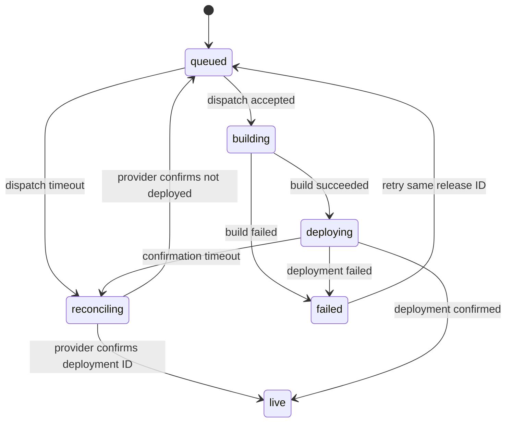

# Phase 0.5 Cloudflare Architecture Spike

Updated: 2026-09-10 UTC

Tasks: S-01 through S-06

Prototype: [`spikes/cloudflare-architecture/`](../../spikes/cloudflare-architecture/)

## Result

The proposed hybrid architecture is viable and Gate G0.5 passed on 2026-09-10. Astro prerenders the public release from an immutable JSON snapshot while `/earth/*` and runtime D1 access remain on-demand Worker routes. The staging proof does not justify an SSR-only site.

The owner confirmed the deployed staging Worker at `https://cms-staging.frong.me`, workerd execution, an operational D1 binding/query path, and rejection of unauthenticated requests by the Cloudflare Access boundary. Exact GitHub workflow-run and Cloudflare provider-deployment identifiers were not supplied for this repository record and are not inferred. No production site or CMS resource was changed.

| Task | Result | Evidence note |
|---|---|---|
| S-01 | Pass | `https://cms-staging.frong.me` owner-verified on workerd; local static/dynamic and deploy dry-run evidence retained below |
| S-02 | Pass | Staging Access guard and unauthenticated rejection owner-verified; local JWT/Origin coverage retained below |
| S-03 | Pass | Staging D1 binding/query path owner-verified; deterministic snapshot/hash tests retained below |
| S-04 | Pass for gate closure | Workflow and payload are committed and locally validated; exact remote run/deployment IDs were not supplied |
| S-05 | Pass: automated failure, timeout, retry, stale callback, missing callback, and repeated-publish drills | Correlate the model with real GitHub run and Cloudflare deployment IDs |
| S-06 | Pass: decisions, commands, timings, quotas, and gaps are recorded here | Append remote timing and identifiers after the staging run |

## S-01: adapter and runtime

The spike has its own package and lockfile; it does not alter the legacy root application. The compatible pinned set is:

- Node.js 24.20.0 locally; workflow baseline Node.js 22, matching the repository's `>=22.12.0` policy.
- Astro 7.3.2.
- `@astrojs/cloudflare` 14.3.1.
- Wrangler 4.130.0. Adapter 14.3.1 requires Wrangler 4.125 or newer.
- `jose` 6.1.0.

Astro 7.2.2 was rejected during the spike because adapter 14.3.1 imported a prerender export only present in the newer compatible Astro line. Astro 7.3.2 built successfully. The package also overrides Miniflare's vulnerable Sharp 0.35.2 with 0.35.4; `npm audit --omit=dev` then reported zero vulnerabilities.

`astro.config.mjs` keeps `output: 'static'`. The public `/` page and `/og/architecture-spike.svg` are prerendered, while `/earth`, `/earth/api/session`, and `/runtime-proof` export `prerender = false`. The adapter uses `prerenderEnvironment: 'workerd'`, so prerender and on-demand behavior are checked against Cloudflare semantics. The separate Node snapshot script completes all filesystem and D1 HTTP work before Astro starts.

The chosen OG path is build-time SVG generation. It produces a static cacheable asset and needs no runtime image binding. Compile-time image optimization is enabled for future raster assets, and Astro sessions are disabled for the spike.

The local D1 proof initialized `cms_releases` through Wrangler and then exercised `env.DB` from `/runtime-proof`. Results:

```text
GET /                         200; prerendered release rel_20260910_spike001
GET /runtime-proof            200; {"runtime":"workerd","binding":"D1"}
GET /earth                    401; Cache-Control: no-store
GET /earth/unmatched          401; Cache-Control: no-store
```

The deploy dry-run read five static asset files and produced a Worker upload of 630.73 KiB uncompressed / 157.91 KiB gzip.

## S-02: Access and server-side authorization

Cloudflare Access is the first boundary. The Worker middleware is a second boundary and never trusts the presence of an identity header alone. For every exact `/earth` or `/earth/*` pathname it:

1. Reads `Cf-Access-Jwt-Assertion`.
2. Loads signing keys from `CF_ACCESS_TEAM_DOMAIN/cdn-cgi/access/certs`.
3. Restricts the algorithm to RS256 and verifies signature, issuer, `CF_ACCESS_AUD`, and time claims through `jose.jwtVerify`.
4. Requires an Access application token (`type: app`), a non-empty subject, and the exact owner email in `CF_ACCESS_ALLOWED_EMAIL`.
5. Requires mutation `Origin` to equal `CMS_SITE_ORIGIN`.
6. Adds `Cache-Control: no-store`; failures are fail-closed with 401, 403, or 503.

Automated tests use a generated RSA key pair and cover valid owner access, missing configuration, missing JWT, wrong issuer, wrong audience, expiry, wrong token type, wrong owner, and mutation Origin. This follows Cloudflare's guidance to verify `Cf-Access-Jwt-Assertion`, its signature, issuer, and audience: [Validate JWTs](https://developers.cloudflare.com/cloudflare-one/access-controls/applications/http-apps/authorization-cookie/validating-json/).

Before staging acceptance, create an Access self-hosted application and ensure all routes that can reach the Worker are covered:

- `https://cms-staging.frong.me/earth` and `https://cms-staging.frong.me/earth/*`.
- The staging `workers.dev` hostname, or disable that hostname.
- Every preview alias, or disable previews for this protected Worker.

Then test missing, expired, wrong-audience, non-owner, and valid owner tokens against every enabled hostname. Access redirect behavior is an outer-gate check; direct Worker requests must still fail in middleware.

## S-03: build-time D1 snapshot

`scripts/fetch-release.mjs` sends a parameterized `POST` to:

```text
/client/v4/accounts/{CF_ACCOUNT_ID}/d1/database/{CF_D1_DATABASE_ID}/query
```

It uses the dedicated `CF_D1_READ_TOKEN`, selects one requested release whose state is `ready` or `live`, validates `manifest_json`, rejects known draft/internal/secret keys recursively, and checks `CMS_MANIFEST_SHA256` before replacing `src/data/release.json`. The API shape follows Cloudflare's [D1 query endpoint](https://developers.cloudflare.com/api/resources/d1/subresources/database/methods/query/).

The fixture contains only public fields. Two consecutive builds of `rel_20260910_spike001` produced byte-identical `dist/client` output:

```text
ee27741cfaa2466da0754aef4a7a04b6e8d37e2520dc9cf2c5de7b40b002b021
```

The generated Worker server bundle is excluded from this content determinism assertion because tool-generated module metadata can vary independently of the immutable public release. Each bundle still passes Wrangler validation.

## S-04: repository dispatch and staging workflow

`.github/workflows/cms-staging-deploy.yml` listens for `cms-staging-release`, sets `contents: read`, serializes releases with `cancel-in-progress: false`, and times out after 15 minutes. The workflow validates the event before dependency installation, generates an ephemeral staging Wrangler config, fetches the requested snapshot, runs tests and build, performs a deploy dry-run, and retains public build evidence for seven days.

The actual staging deploy is additionally guarded by the protected `cms-staging` environment variable `CMS_SPIKE_DEPLOY=true`. It uses a separate `CF_DEPLOY_TOKEN`; the D1 read token is never used for deployment. The ephemeral secrets file contains the Access audience and owner email and is excluded from artifacts and Git.

Accepted request body:

```json
{
  "event_type": "cms-staging-release",
  "client_payload": {
    "release_id": "rel_20260910_spike001",
    "manifest_sha256": "01419e593ab155f2488b6e5391a6ea09f9edfea64efa76a6f68602508371d708"
  }
}
```

No token, database locator, email, hostname, or content is accepted in `client_payload`. GitHub requires this workflow to exist on the default branch. A fine-grained dispatch token needs repository Contents write permission; the workflow itself needs only Contents read. See GitHub's [repository dispatch event](https://docs.github.com/en/actions/reference/workflows-and-actions/events-that-trigger-workflows#repository_dispatch) and [Create a repository dispatch event](https://docs.github.com/en/rest/repos/repos#create-a-repository-dispatch-event).

Required `cms-staging` environment configuration:

| Kind | Name | Purpose |
|---|---|---|
| Variable | `CMS_SPIKE_DEPLOY` | Set to `true` only when remote staging deployment is approved |
| Variable | `CMS_SITE_ORIGIN` | Exact staging origin for mutation checks |
| Variable | `CF_ACCESS_TEAM_DOMAIN` | HTTPS Cloudflare Access team origin |
| Variable | `CF_D1_DATABASE_NAME` | Staging D1 display name |
| Secret | `CF_ACCESS_AUD` | Access application audience |
| Secret | `CF_ACCESS_ALLOWED_EMAIL` | Authorized owner identity |
| Secret | `CF_ACCOUNT_ID` | Cloudflare account locator |
| Secret | `CF_D1_DATABASE_ID` | Staging D1 database locator |
| Secret | `CF_D1_READ_TOKEN` | D1 Read only |
| Secret | `CF_DEPLOY_TOKEN` | Staging Worker deploy only |

The future authenticated CMS endpoint sends the dispatch using its server-only `GITHUB_DISPATCH_TOKEN`:

```sh
curl --fail-with-body -X POST \
  -H 'Accept: application/vnd.github+json' \
  -H "Authorization: Bearer $GITHUB_DISPATCH_TOKEN" \
  -H 'X-GitHub-Api-Version: 2026-03-10' \
  https://api.github.com/repos/Watcharapol-Frong/portfolio/dispatches \
  --data @spikes/cloudflare-architecture/fixtures/repository-dispatch.json
```

Expected API status is 204. It was not sent in this session because the available `GITHUB_TOKEN` fails `gh auth status`.

## S-05: failure and recovery

The proof state machine separates the pending release from the live pointer:



Rules proven by tests:

- Build and deployment failures preserve the old `live` record.
- A dispatch or callback timeout becomes `reconciling`; it never becomes `live`.
- A release in `reconciling` can be dispatched again only after the provider confirms no matching deployment exists.
- A live transition requires a provider deployment ID correlated with the same release ID and manifest hash.
- Repeating the same publish request is idempotent; a different release is rejected while another is active.
- Callbacks for stale release IDs do not mutate state.
- GitHub concurrency is an additional serialization guard; durable release state remains authoritative.

Cloudflare Worker deployment is treated as the provider's atomic site replacement. The application live pointer changes only after provider confirmation. A missing application callback therefore cannot make a failed or uncertain build appear live.

## S-06: commands, timings, and limits

All commands below operate only on the isolated spike:

```sh
cd spikes/cloudflare-architecture
npm ci
npm test
XDG_CONFIG_HOME=/tmp/frong-wrangler npm run check
XDG_CONFIG_HOME=/tmp/frong-wrangler npm run d1:local:init
XDG_CONFIG_HOME=/tmp/frong-wrangler npm run build
XDG_CONFIG_HOME=/tmp/frong-wrangler npm run test:determinism
XDG_CONFIG_HOME=/tmp/frong-wrangler npm run deploy:dry
npm audit --omit=dev
```

Local route proof after build:

```sh
XDG_CONFIG_HOME=/tmp/frong-wrangler npm run preview -- --host 127.0.0.1 --port 4321
curl -i http://127.0.0.1:4321/
curl -i http://127.0.0.1:4321/runtime-proof
curl -i http://127.0.0.1:4321/earth
curl -i http://127.0.0.1:4321/earth/unmatched
npx astro preview stop
```

Observed local timings are development-machine measurements, not staging service-level targets:

| Operation | Result | Observed time |
|---|---|---:|
| Unit/security/failure tests | 4 test files, all pass | 1.7–2.0 s |
| Astro type/content check | 0 errors/warnings/hints | 16.3 s cold |
| Local D1 schema/fixture setup | 2 statements | 2.0 s |
| Staging-config workerd build | static + server bundle pass | 4.5 s |
| Two public-output builds | identical SHA-256 | 9.1 s total |
| Wrangler deploy dry-run | pass, no upload | 1.4–1.8 s |
| GitHub queue/build/deploy | Not measured | Remote evidence required |

Verified current platform limits relevant to this choice:

- Workers: 64 MiB uncompressed Worker, 128 MiB memory, 1 second startup, 20,000 static assets on Free or 100,000 on Paid, and 25 MiB per static file. The 630.73 KiB proof bundle is below the upload limit. See [Workers limits](https://developers.cloudflare.com/workers/platform/limits/).
- D1: 100 KB SQL statement, 100 bound parameters, 2 MB maximum row/string/BLOB, and 30-second maximum query. The proof uses one short statement and one parameter. See [D1 limits](https://developers.cloudflare.com/d1/platform/limits/).
- Repository dispatch: `event_type` is at most 100 characters, `client_payload` has at most 10 top-level fields and is under 64 KB. The proof uses two payload fields. See [GitHub's REST endpoint](https://docs.github.com/en/rest/repos/repos#create-a-repository-dispatch-event).

## Remote evidence follow-up

Gate G0.5 is closed from the owner-confirmed staging results above. Preserve the
following identifiers and timings when they become available; this follow-up
improves auditability but does not reopen the gate.

1. Confirm the workflow exists on the repository default branch and configure the protected `cms-staging` environment names above.
2. Create or identify an isolated staging Worker and D1 database; do not reuse production IDs.
3. Configure Access for the custom domain and every enabled alternate hostname.
4. Run `fetch-release.mjs` against staging with the D1 Read token and record the release/hash without recording credentials.
5. Send the sample dispatch. Record API 204, workflow run ID, queue time, build time, Cloudflare deployment ID, and deploy time.
6. Repeat static, dynamic D1, missing/invalid/valid JWT, owner, Origin, workers.dev, and preview-host checks against staging.
7. Force one workflow build failure and one missing-confirmation case; confirm the previous staging deployment stays live and provider reconciliation uses the same release ID.
8. Append the evidence here without recording credentials or changing the completed gate result.
